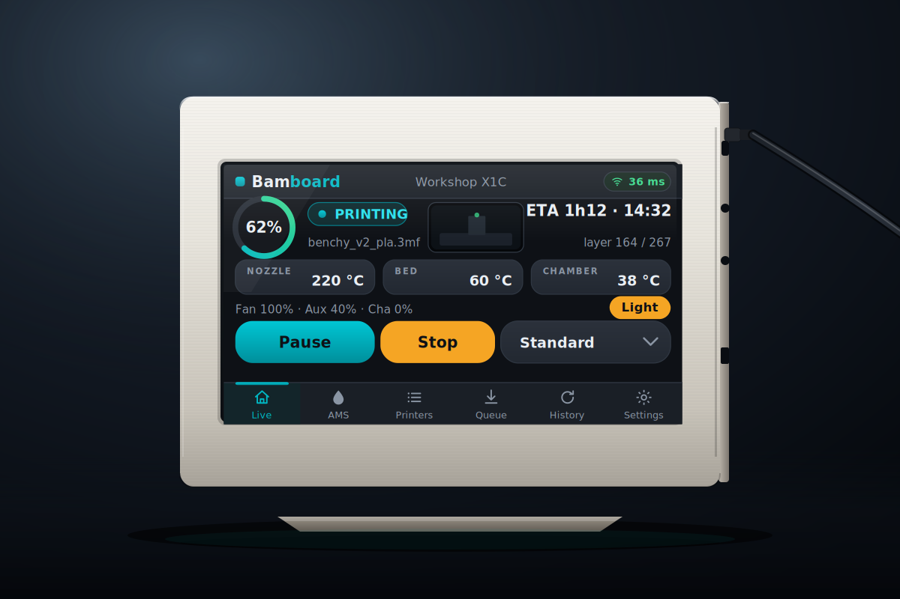
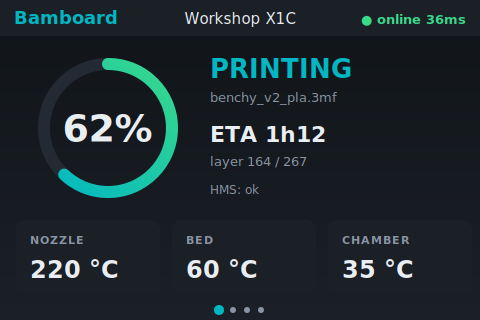
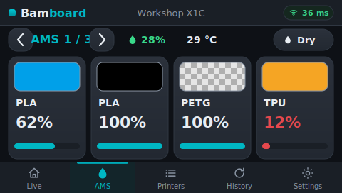
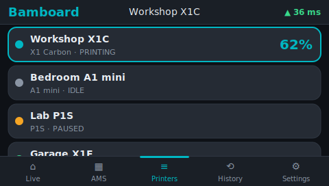
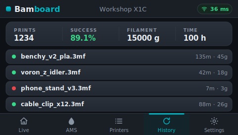
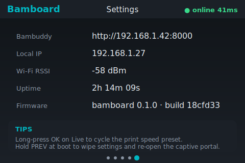

# Bamboard

> A budget, open-source touch desk monitor for your Bambu Lab printers
> — powered by [Bambuddy](https://github.com/maziggy/bambuddy).

Bamboard is a small ESP32-S3 device with a 4.3" capacitive touch screen
that lives on your desk and shows you, in real time, what your Bambu Lab
printers are doing. It talks **only** to your self-hosted Bambuddy
instance over its REST + WebSocket API — your printers never see a
third-party cloud.

Total BOM is around **20 €** (single all-in-one board, USB-C cable, 4
screws, ~70 g of filament for the case). The enclosure is FDM-printable
on any Bambu (or other) printer with a 0.4 mm nozzle.



| Live | AMS | Printers | History | Settings |
|------|-----|----------|---------|----------|
|  |  |  |  |  |

> 1:1 SVG mockups of the **touch UI** at the real 480 × 272 panel
> resolution. Every screen carries the **Bamboard** wordmark header (with
> the focused printer and a Wi-Fi link badge) and a permanent bottom tab
> bar whose active screen lights up — icon, label and a 3 px accent strip.
> On Live a single **print-speed** button opens a four-way speed menu, on
> AMS the chevrons flank the unit label and each slot is a colour-swatch
> card (clear filament shown as a checkerboard, dark filament outlined),
> and on Settings a 1–5 segmented selector controls the panel brightness.

## Features

### What you see on the screen

- **Live dashboard** — nozzle / bed / chamber temperature, layer progress, ETA, filename.
- **AMS overview** — per-slot filament colour / type / remaining %, plus AMS humidity, temperature and active drying countdown. Each slot is a colour swatch: every swatch is outlined so even **black** filament reads on the dark panel, and **clear / translucent** filament shows a **checkerboard** instead of a flat square. Big ◀ / ▶ side buttons cycle through chained AMS units, and a one-tap **Dry / Stop** pill on heater-equipped units (**AMS-HT and AMS 2 Pro**) starts (or aborts) a drying cycle whose **temperature and duration are taken from the loaded filament** — Bambu's per-spool RFID profile when present, a per-filament-type fallback otherwise.
- **Printers list** — every printer Bambuddy knows about, highlighted by state. **Tap a row** to focus that printer and jump to Live.
- **History & stats** — last 10 prints, success rate, total filament, total time.
- **Settings** — Bambuddy URL, local IP, Wi-Fi RSSI, uptime, **brightness 1–5** segmented selector, and a two-tap **Factory reset** button.

### Alerts

- **HMS surfacing** — the HMS string is shown in red on the dashboard, and a full-screen pulsing red overlay pops every 30 s while the error persists. Tap anywhere to dismiss; the overlay re-arms after the cooldown so the alert can't be silenced indefinitely.

### Controls (touch-first)

- **Bottom tab bar** — 5 tabs always visible (Live / AMS / Printers / History / Settings). Tap to switch.
- **Swipe gesture** — swipe left / right inside the screen body to move to the next / previous tab.
- **Inline action area on Live** — appears contextually based on the focused printer's state:
  - while printing → a 4-segment **speed chip** (Silent / Standard / Sport / Ludicrous); tap a segment to switch — the active one is highlighted in accent;
  - when finished → `Clear plate` pill;
  - while an HMS error is active → red `Clear HMS` pill (takes priority over the other two).
- **Brightness 1–5** — segmented selector on Settings. Persisted to NVS and applied at boot. The auto-dim wake target follows the chosen level instead of always ramping to full.
- **Factory reset** — Settings → "Factory reset" → tap a second time within 3 s to confirm. Wipes **all** persisted settings (Wi-Fi + Bambuddy creds, timezone, daily-reboot hour, brightness and interface language) and reboots into the captive portal.

### Connectivity

- **WebSocket push** — subscribes to Bambuddy's `/ws` for real-time `printer_status` frames. REST polling stays as a 30 s safety net (vs. 2 s when WS is down). Cuts HMS-alert latency from a poll cycle to one network hop.
- **Wi-Fi captive portal** — first-boot Wi-Fi + Bambuddy URL + API key + timezone / daily-reboot-hour + **interface language** (EN / ES / FR / PT / DE) setup; no re-flash needed to change them. Hold the side **BOOT** button at boot to re-run it.
- **Auto-dim** — backlight drops after 60 s without a touch, wakes on the next tap.

### Install & updates

- **Browser-based install** — flash the latest firmware straight from the [web installer](https://clabeuhtegrite.github.io/Bamboard/) in Chrome / Edge / Opera (no CLI, no toolchain). Only needed for the very first install — everything after lands over the air. Firefox / Safari / Linux users can flash `bamboard-factory.bin` from the latest release with `esptool` instead.
- **Over-the-air updates from GitHub** — on every boot the device checks this repo's latest GitHub Release. If it carries a newer firmware than the one running, the device downloads and flashes it (with a full-screen progress overlay) before coming up — no PC, no LAN tooling, no being on the same network. If it's offline or already current, boot continues normally. The device also **reboots itself once a day at local midnight**, so this check runs unattended — new releases land overnight with no power-cycle (timezone configurable in `config.h`). Releases are built and published automatically by [`.github/workflows/release.yml`](.github/workflows/release.yml) on every pushed `v*` tag. See [docs/flashing.md](docs/flashing.md).

## Repo layout

```
.
├── firmware/        PlatformIO project (ESP32-S3 + LVGL + LovyanGFX)
│   ├── src/         C++ sources
│   │   ├── hw/      Display + GT911 touch HAL (LovyanGFX-based)
│   │   ├── net/     Bambuddy REST + WebSocket clients + GitHub OTA updater
│   │   ├── ui/      LVGL screen manager + per-screen builders
│   │   ├── config.h All compile-time tunables
│   │   └── main.cpp Boot, Wi-Fi provisioning, FreeRTOS tasks, boot-time OTA
│   ├── include/     lv_conf overrides
│   └── platformio.ini
├── .github/         CI: build-check every push; publish release + web installer on v* tags
├── sim/             Host LVGL simulator — CI renders every screen to PNG for review
├── web/             Browser-based flasher (ESP Web Tools → GitHub Pages)
├── hardware/        Bill of materials, wiring diagram
├── case/            Parametric OpenSCAD enclosure + STL exports
└── docs/            Assembly, flashing, configuration guides
```

## Quick start

1. Order the parts from `hardware/bom.md` (~20 €).
2. Print the enclosure: `case/bamboard.scad` → export STL → slice → print PLA / PETG.
3. Drop the Guition board into the front shell, clip the back shell on,
   drive four M3 × 6 mm screws. (No wiring — everything's on the one PCB.)
4. Flash the firmware: plug the board in via USB-C, open the
   [web installer](https://clabeuhtegrite.github.io/Bamboard/) in Chrome /
   Edge / Opera and click **Connect**. See [docs/flashing.md](docs/flashing.md)
   for details (and the esptool fallback for Firefox / Safari / Linux).
5. First boot: device exposes a `Bamboard-setup` Wi-Fi AP, connect, and via
   the captive portal fill in your Wi-Fi credentials, your Bambuddy URL +
   API key, your timezone + daily-reboot hour, and the interface language.
6. Enjoy.

## Requirements

- A running Bambuddy instance (see https://github.com/maziggy/bambuddy)
- A Bambuddy API key with at least `printers:read` and `statistics:read`
  permissions (add `printers:control` if you want to use the inline
  Speed / Clear plate / Clear HMS actions).

## License

MIT — see [LICENSE](LICENSE). Bamboard is not affiliated with Bambu Lab
or with the Bambuddy project.
